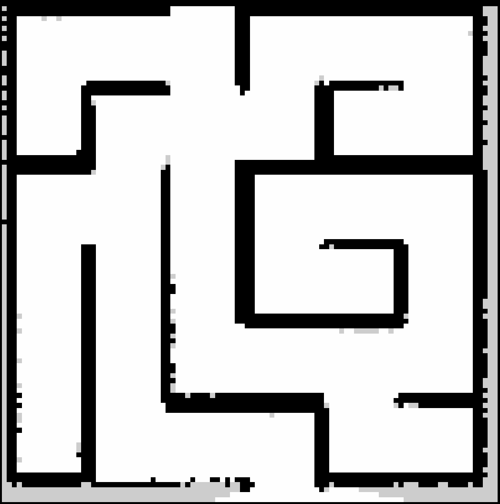
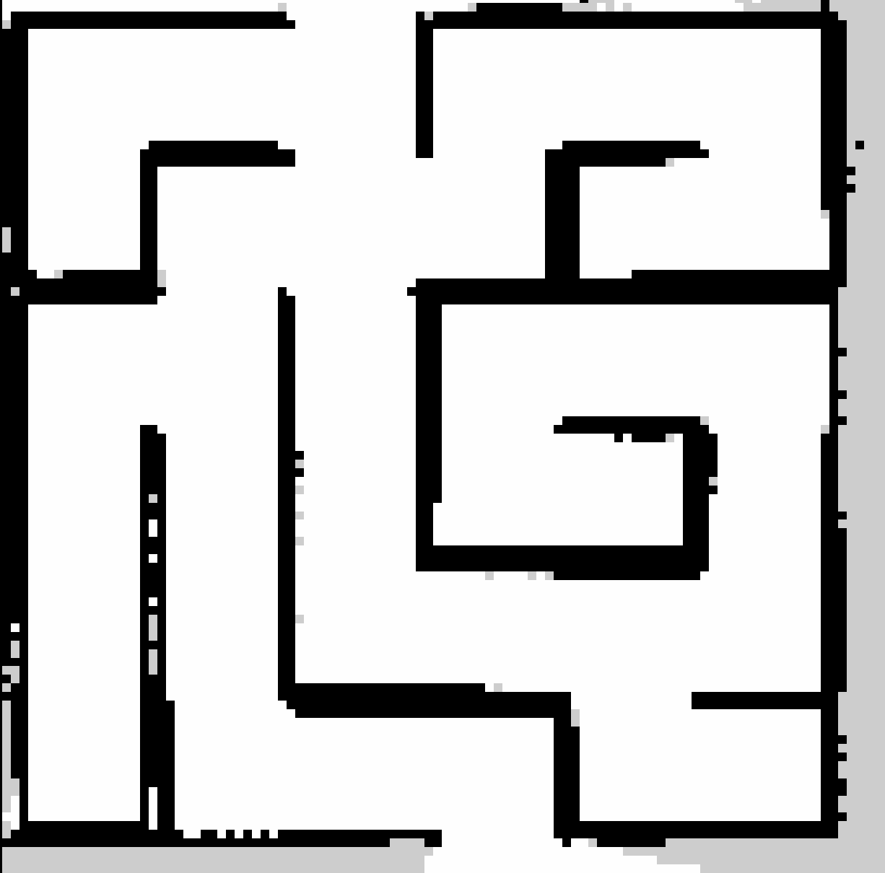

# Proyecto de Robótica - SLAM y AMCL

Este proyecto implementa dos algoritmos fundamentales de robótica móvil: **SLAM** (Simultaneous Localization and Mapping) y **AMCL** (Adaptive Monte Carlo Localization) para navegación autónoma de robots.

## 📋 Descripción de los Algoritmos

### 🗺️ SLAM (Simultaneous Localization and Mapping)
**Archivo:** `pra_ws/src/turtlebot3_slam_mapper/turtlebot3_slam_mapper/python_slam_node.py`

- **Objetivo:** Construir un mapa del entorno mientras el robot estima simultáneamente su propia posición
- **Algoritmo:** FastSLAM con filtro de partículas
- **Características:**
  - Cada partícula mantiene su propio mapa en log-odds
  - Modelo de movimiento probabilístico basado en odometría
  - Actualización de mapas usando datos del sensor láser
  - Remuestreo de partículas para mantener diversidad

### 🎯 AMCL (Adaptive Monte Carlo Localization)
**Archivo:** `pra_ws/src/my_py_amcl/my_py_amcl/amcl_node.py`

- **Objetivo:** Localizar el robot en un mapa conocido y navegar autónomamente hacia objetivos
- **Algoritmo:** Filtro de partículas para localización + Pure Pursuit para navegación
- **Características:**
  - Localización probabilística usando filtro de partículas
  - Planificación de rutas con algoritmo A*
  - Control de navegación con Pure Pursuit
  - Evasión de obstáculos en tiempo real
  - Inflado de mapas para navegación segura

## 🎥 Resultados

### SLAM - Construcción de Mapas
El algoritmo SLAM fue capaz de construir mapas precisos del entorno:

#### Video de SLAM en Acción

#### Mapas Generados
**Mapa Original:**

**Mapa Actualizado:**

### AMCL - Localización y Navegación
El algoritmo AMCL demostró capacidad de localización precisa y navegación autónoma:

#### Video de AMCL en Acción

## 🚀 Funcionamiento

### SLAM
1. **Inicialización:** Partículas distribuidas aleatoriamente
2. **Movimiento:** Actualización de poses basada en odometría con ruido
3. **Observación:** Cálculo de pesos usando coincidencias láser-mapa
4. **Mapeo:** Actualización de mapas individuales por partícula
5. **Remuestreo:** Eliminación de partículas con bajo peso

### AMCL  
1. **Localización:** Estimación de pose usando filtro de partículas
2. **Planificación:** Cálculo de rutas óptimas con A*
3. **Navegación:** Seguimiento de trayectorias con Pure Pursuit
4. **Evasión:** Detección y evitación de obstáculos dinámicos
5. **Control:** Comandos de velocidad para alcanzar objetivos

